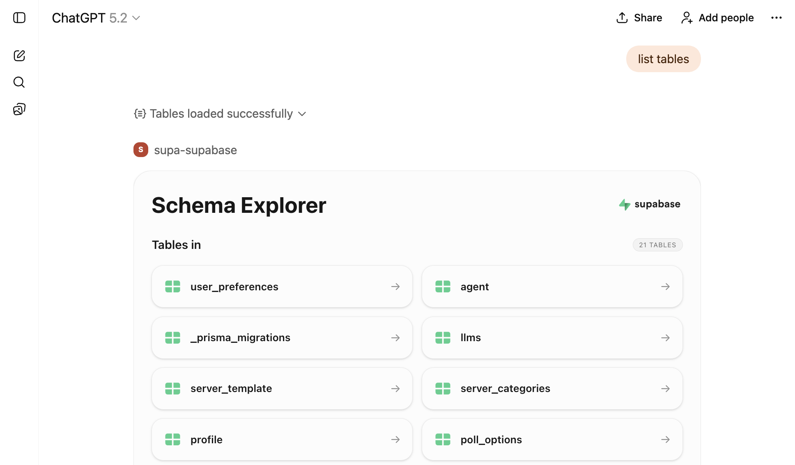

# Supabase MCP Server



A powerful Model Context Protocol (MCP) server for Supabase, **built with [mcp-use](https://github.com/mcp-use/mcp-use)**. This server provides interactive tools and beautiful React widgets for exploring and querying your Supabase database.

## 🚀 Built with mcp-use

This MCP server is powered by **[mcp-use](https://github.com/mcp-use/mcp-use)**, a modern framework for building MCP servers with:

- **Type-safe server creation** - Build MCP servers with full TypeScript support
- **React widget support** - Create interactive UI components using the OpenAI Apps SDK
- **Simplified client connections** - Easily connect to other MCP servers without LangChain
- **Built-in development tools** - Hot reload, build, and deploy commands
- **Zero boilerplate** - Focus on your tools, not infrastructure

## Features

- 🔍 **Database Schema Explorer** - Browse all tables in your Supabase database with an interactive UI
- 📊 **Table Viewer** - Display and explore table data with a beautiful data table widget
- 🔎 **SQL Query Executor** - Run read-only SQL queries and view results in an interactive widget
- 🎨 **React Widgets** - Rich, interactive UI components built with React and Tailwind CSS
- 🔐 **Secure Authentication** - Uses Supabase Personal Access Tokens for secure access

## Prerequisites

- Node.js 18+ and yarn
- A Supabase project
- A Supabase Personal Access Token ([generate one here](https://supabase.com/dashboard/account/tokens))

## Installation

```bash
# Install dependencies
yarn install
```

## Configuration

Set the following required environment variables:

```bash
# Required: Your Supabase Personal Access Token
export ACCESS_TOKEN="your-access-token"

# Required: Content Security Policy URLs for widget loading => required by ChatGPT
export CSP_URLS="https://supabase.com,https://mcp.supabase.com,https://*.mcp-use.com,https://*.supabase.co"
```

## Development

[mcp-use](https://github.com/mcp-use/mcp-use) provides convenient development commands:

```bash
# Start development server with hot reload
yarn dev

# Build for production
yarn build

# Start production server
yarn start

# Deploy the server
yarn deploy
```

## Available Tools

### `list-tables`

List all tables in your Supabase database. Opens an interactive schema explorer widget.

**Parameters:**

- `schemas` (optional): Array of schema names to include (default: `["public"]`)

**Widget:** `schema-explorer` - Interactive table browser with schema information

### `show-table`

Display data from a specific table. Opens a data table viewer widget.

**Parameters:**

- `tableName` (required): Name of the table to display
- `schema` (optional): Schema name (default: `"public"`)
- `limit` (optional): Maximum number of rows to fetch (default: `100`)

**Widget:** `table-viewer` - Interactive data table with sorting and filtering

### `execute-sql`

Execute read-only SQL queries on your Supabase database. Opens a query results widget.

**Parameters:**

- `query` (required): SQL query to execute

**Widget:** `query-results` - Interactive query results viewer with syntax highlighting

## Available Resources

### `supabase://project-url`

Get the API URL for your Supabase project.

## UI Widgets

This server includes three custom React widgets built with [mcp-use](https://github.com/mcp-use/mcp-use):

1. **Schema Explorer** (`schema-explorer`) - Browse database tables and schemas
2. **Table Viewer** (`table-viewer`) - View and explore table data
3. **Query Results** (`query-results`) - Display SQL query results

All widgets are built with:

- React 19
- Tailwind CSS
- Radix UI components
- Lucide React icons

## Architecture

This server demonstrates the power of [mcp-use](https://github.com/mcp-use/mcp-use):

- **Server-side**: Uses [`mcp-use/server`](https://github.com/mcp-use/mcp-use) to create tools, resources, and widgets
- **Client-side**: Uses [`mcp-use/client`](https://github.com/mcp-use/mcp-use) to connect to Supabase's official MCP server
- **No LangChain**: Direct MCP client connections without external dependencies
- **Type-safe**: Full TypeScript support with Zod schemas

## Project Structure

```
.
├── index.ts                 # Main server file using [mcp-use](https://github.com/mcp-use/mcp-use)
├── resources/               # React widget components
│   ├── components/         # Reusable UI components
│   ├── schema-explorer/    # Schema explorer widget
│   ├── table-viewer/       # Table viewer widget
│   ├── supabase-status/    # Display Supabase status for a certain time window
│   └── query-results/      # Query results widget
└── package.json            # Dependencies including [mcp-use](https://github.com/mcp-use/mcp-use)
```

## License

MIT

